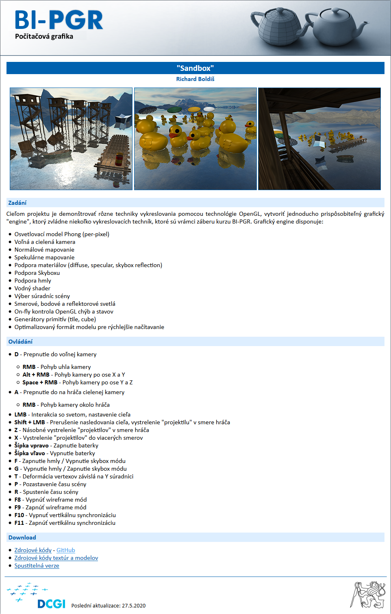
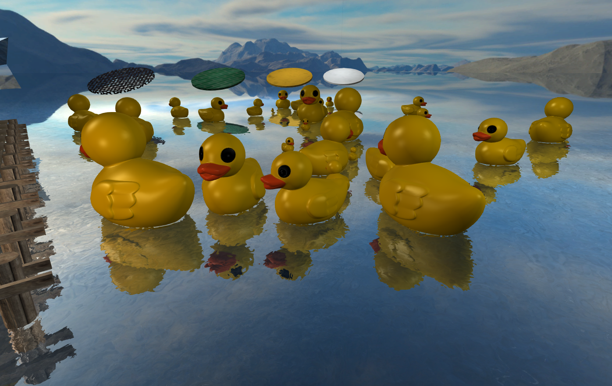
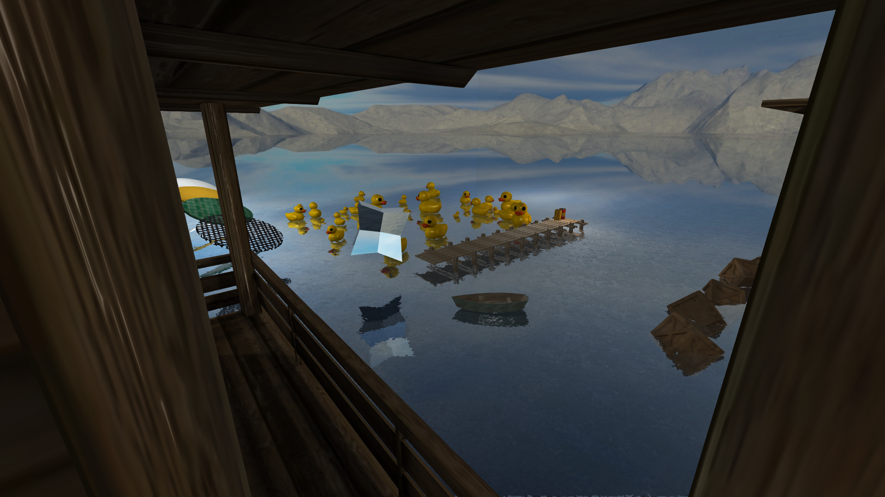
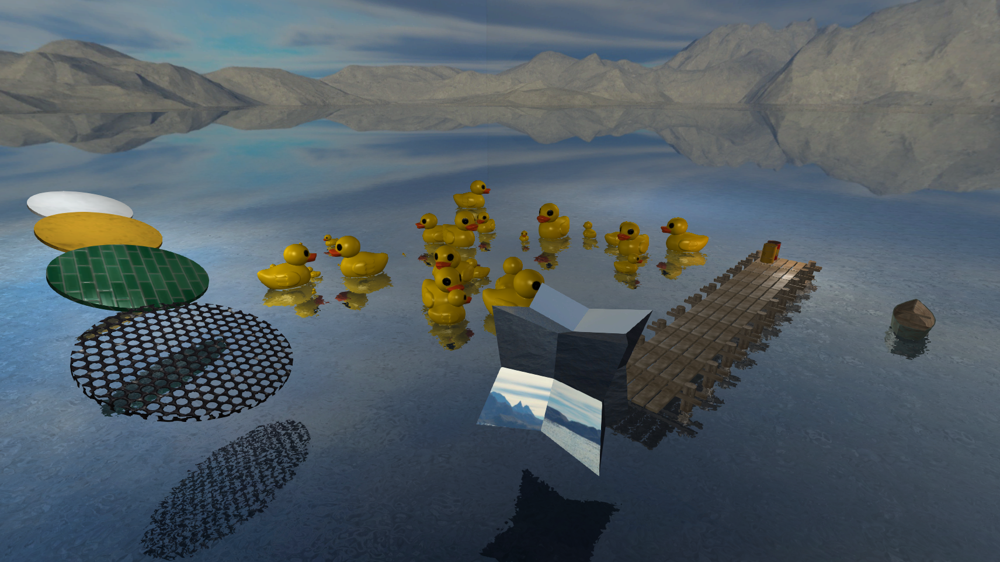

# Sandbox

Semestral project of BI-PGR course on CTU in Prague, FIT.

## Development setup

Create `DEV_HOME` environment variable containing the path to the folder, which has the following structure:
- `Include`
- `Library`

This project requires following external libraries to be available.
- assimp [5.0.1](https://github.com/assimp/assimp/releases/tag/v5.0.1)
- glew [2.1.0](https://github.com/nigels-com/glew/releases/tag/glew-2.1.0)
- glfw [3.3.2](https://github.com/glfw/glfw/releases/tag/3.3.2)
- gli [559cbe1ec38878e182507d331e0780fbae5baf15](https://github.com/g-truc/gli/tree/559cbe1ec38878e182507d331e0780fbae5baf15) Last release of this library was on November 12th 2016 and is broken.
- glm [0.9.9.8](https://github.com/g-truc/glm/releases/tag/0.9.9.8)

### Dependencies
Install gli into `External` directory.

#### Ubuntu / Debian
`apt install libglfw3-dev libglew-dev libglm-dev zlib1g-dev libassimp-dev libyaml-cpp-dev libbullet-dev`

#### Arch
`pacman -Sy glfw-x11 glew glm zlib assimp yaml-cpp bullet`

# Assessment










## Build

### Linux (Ubuntu)
Install dependencies using apt.
```shell
apt-get install -y cmake ninja-build libglew-dev libglfw3-dev libglm-dev zlib1g-dev libassimp-dev libyaml-cpp-dev libbullet-dev
```

Generate project with CMake (Ninja generator)
```shell
cmake -G Ninja -D CMAKE_BUILD_TYPE=Release -B Build
```

Build
```shell
cmake --build Build -- -j$(nproc)
```

### Windows
Install dependencies using vcpkg
```
vcpkg install --triplet x64-windows glew glfw3 glm zlib assimp yaml-cpp bullet3
```

Install gli into "External" directory (External/gli/gli.hpp)

Generate project with CMake
```
cmake -DCMAKE_TOOLCHAIN_FILE=<path_to_vcpkg>/scripts/buildsystems/vcpkg.cmake -B Build
```

Build
```
cmake --build Build
```
